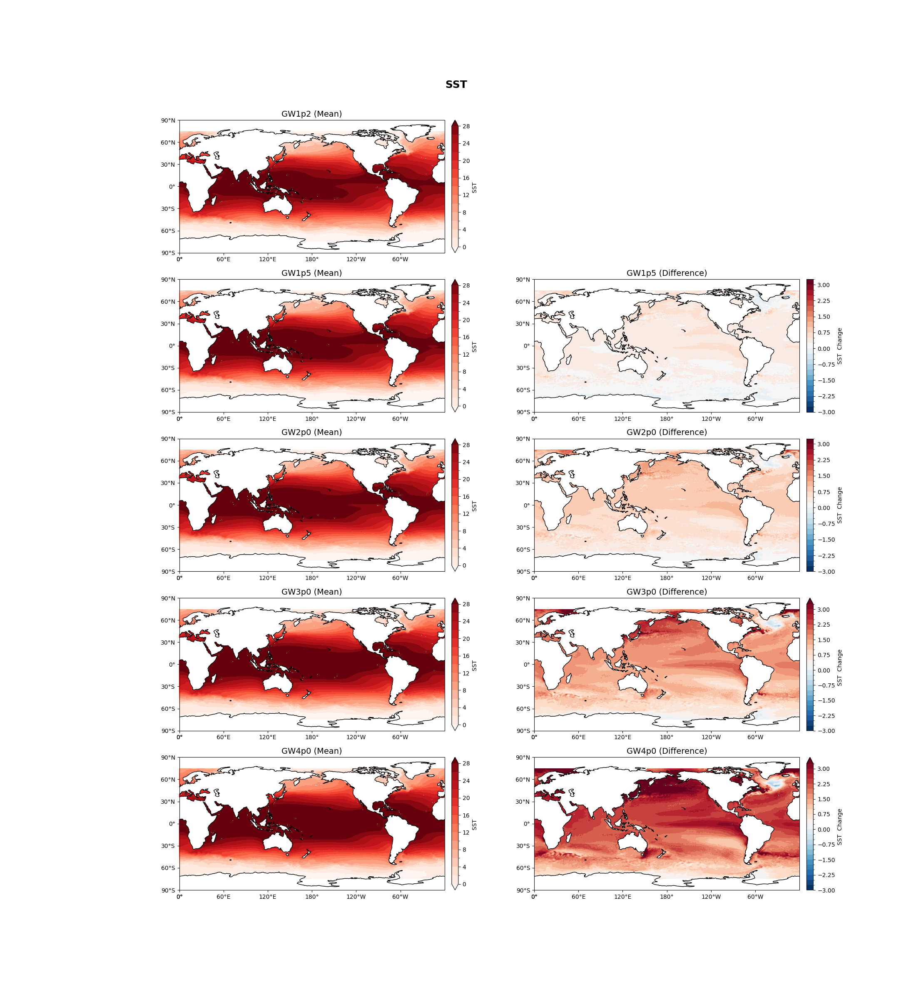
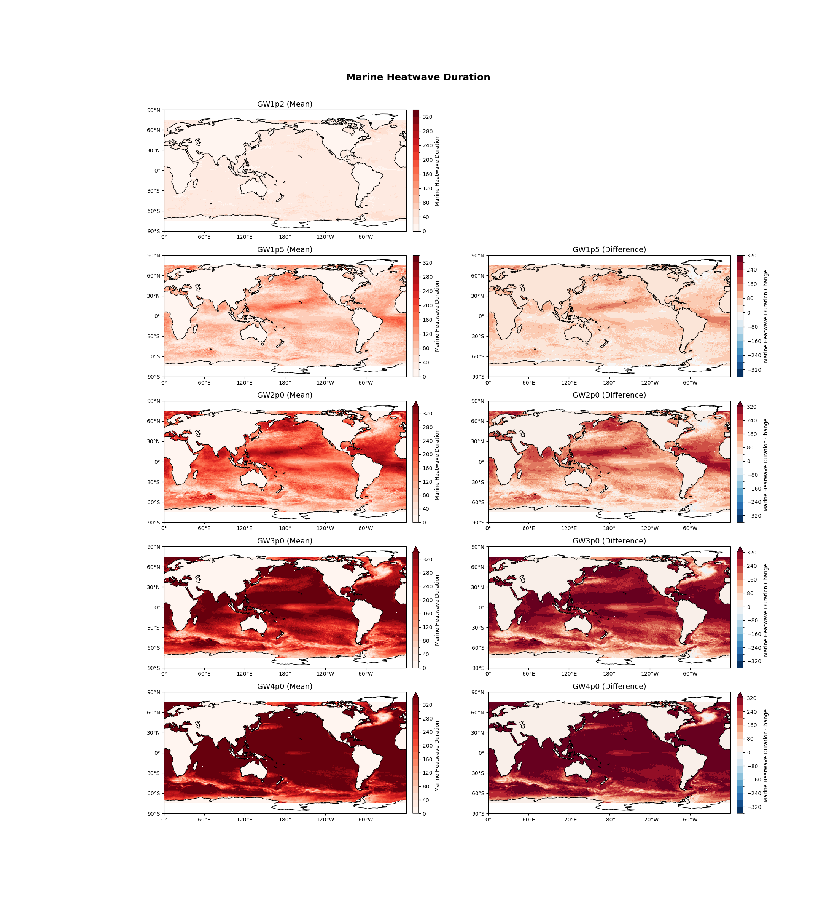
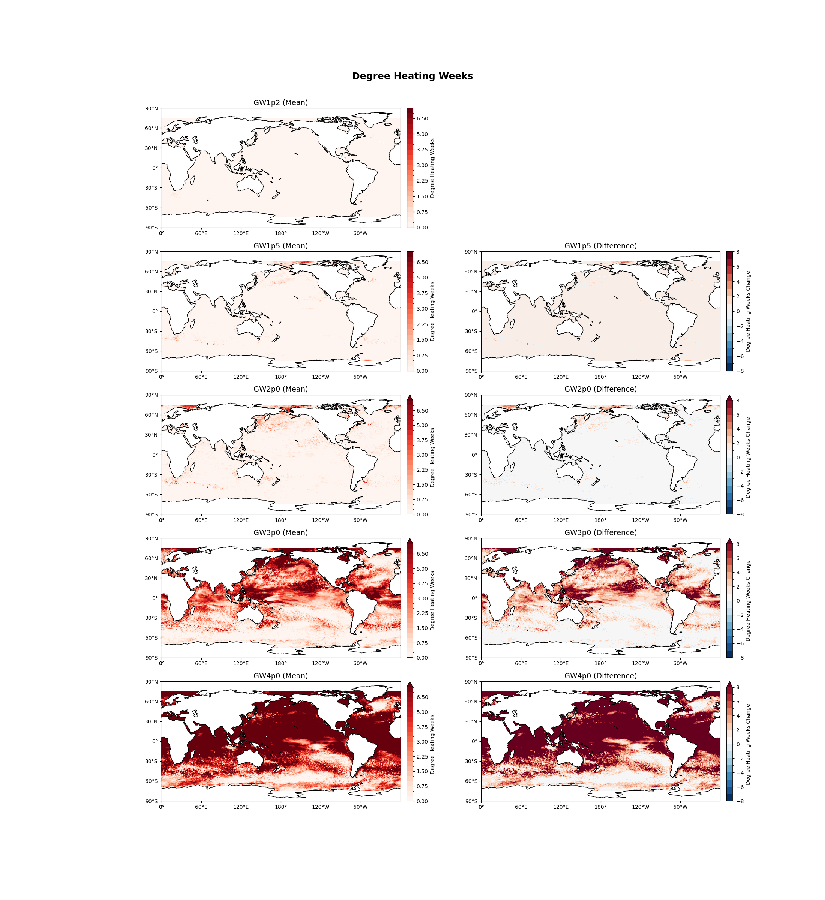
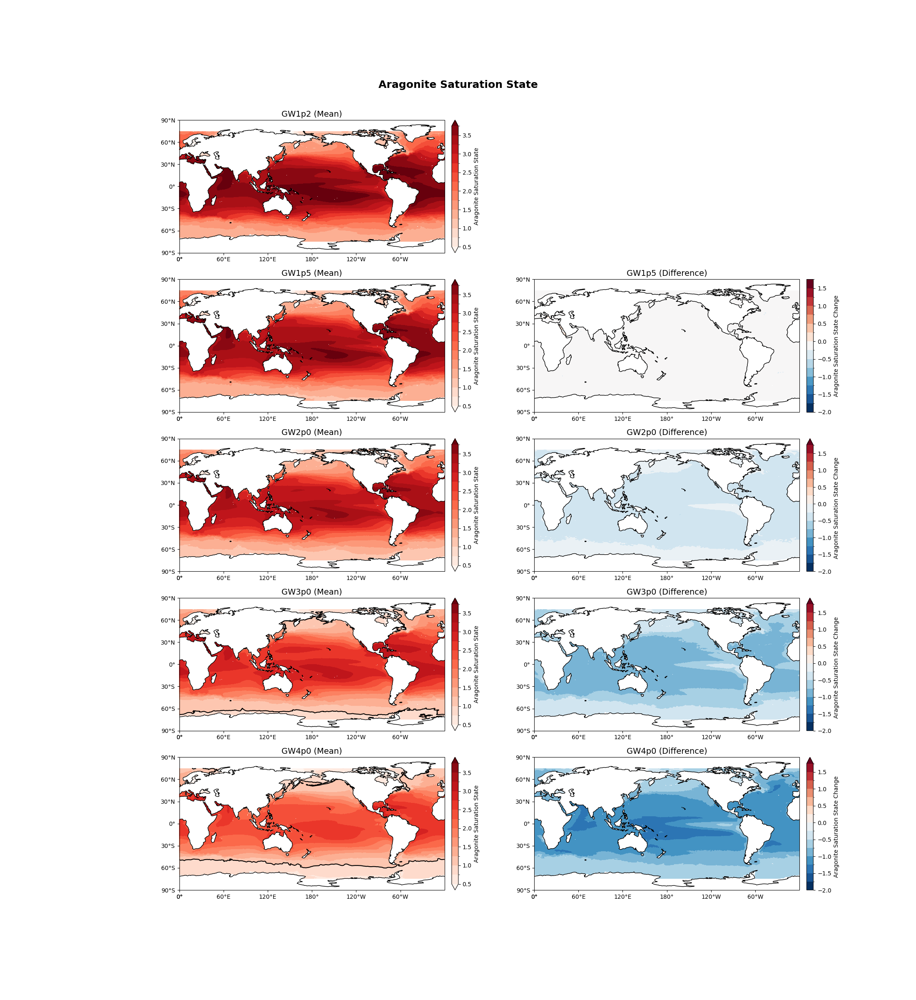

# hazard_ocean repository 

Description, diagnostics and plots showing ocean fields in a future climate

The respository was initiated for the Australia first National Climate Risk Assessment

## Simulations 
The data displayed come from a future simulation that uses the multi-model mean forcings from RCP8.5 projection to drive an 
ocean eddy-resolving model (OFAM3).  The references for the simulations are:

- Feng, M., Zhang, X., Oke, P., Monselesan, D., Chamberlain, M. A., Matear, R. J., & Schiller, A. (2016). Invigorating ocean boundary current systems around Australia during 1979–2014: As simulated in a near-global eddy-resolving ocean model. Journal Of Geophysical Research-Oceans.
- Hayashida, H., Matear, R. J., & Strutton, P. G. (2020). Background nutrient concentration determines phytoplankton bloom response to marine heatwaves. Global Change Biology, 26(9), 4800–4811. https://doi.org/10.1111/gcb.15255
- Hayashida, H., Matear, R. J., Strutton, P. G., & Zhang, X. (2020). Insights into projected changes in marine heatwaves from a high-resolution ocean circulation model. Nature Communications, 11(1), 1–9. https://doi.org/10.1038/s41467-020-18241-x
- Matear, R. J., Chamberlain, M. A., Sun, C., & Feng, M. (2015). Climate change projection for the western tropical Pacific Ocean using a high-resolution ocean model: Implications for tuna fisheries. Deep Sea Research Part II: Topical Studies in Oceanography, 113(0), 22–46.
- Matear, R. J., Chamberlain, M. A., Sun, C., & Feng, M. (2013). Climate change projection of the Tasman Sea from an Eddy-resolving Ocean Model. Journal Of Geophysical Research-Oceans, 118(6), 2961–2976.
- Zhang, X., Oke, P. R., Feng, M., Chamberlain, M. A., Church, J. A., Monselesan, D., et al. (2016). A near-global eddy-resolving OGCM for climate studies. Geoscientific Model Development Discussions.

## Diagnostics
The key ocean diagnostics are displayed according to Global Warming Levels (GWLs) using the 20 year period that define a given GWL.  The key ocean diagnostics are:

1. Sea Surface Temperature monthly climatology
1. Surface Aragonite Saturation State monthly climatology
1. Surface pH monthly climatology
1. Intensity of Marine Heat Wave
1. Duration of Marine Heat Wave
1. NPP monthly climatology (N mol/m^2/s)
1. Degree Heating Weeks (average of the annual maximum value dhw_amax, maximum (dhw_max) and minimum (dhw_max) annual value over GWL period
1. Bottom Temperature (bot_temp directory)
1. Full ocean depth temperature (note simulation used restoring to T and S below 2000m) (directory all_depths_temp)
1. Magnitude of Bottom Stress (bmf)
1. Bottom aragonite saturation state (needs to be computed)

## Method 
The code for MHW and DHW is included in the repository with a notebook for each diagnostic to check
the calculation at a specified point.  The ocean acidification calculations were done seperately using
fortran/ferret code.

   
## Key Messages
### Background

The oceans take up heat and carbon as rising atmospheric CO2 warms the planet. 
Ocean warming and acidification are observable and long-term trends with chronic and 
acute impacts on marine organisms and ecosystems. 
Warming and acidification are evident in all marine environments around Australia. 
The warming trend will change the occurrence of extreme heat events like marine heatwaves. 
Ocean warming is causing the kelp forests of southern Australia to disappear and creating 
conditions more conducive to coral bleaching). 
Ocean acidification will impact the ability of organisms to calcify (e.g. corals, shells, skeletons).

## Insights ​ for Warming and Acidification

- Increased frequency and duration of marine heatwaves increase the likelihood of more frequent and severe coral bleaching events.​
- Tasman Sea approaches a permanent marine heatwave state by GWL3. ​
- Great Barrier Reef and Ningaloo Reef will experience annual conditions for extreme bleaching by GWL3. ​
- Acidity at GWL3: Southern Ocean surface waters south of 60°S will drop below an annual mean aragonite saturation state of 1. Values above 1.0 are required to produce calcareous shells or skeletons optimally.
Values below 1 are considered corrosive, and skeletons and shells may be subject to dissolution. ​
- The ocean environment will become more stressful for marine organisms and ecosystems.

##  Data/confidence ​

- Confidence: high confidence in the direction of change, medium confidence in the magnitude of change and low confidence in the ecological consequence of the changes.​ (consistent with IPCC AR6)
- Limitation: ocean simulations that are not well suited for representing the high-resolution dynamics and features of the Australian coastal areas.​

